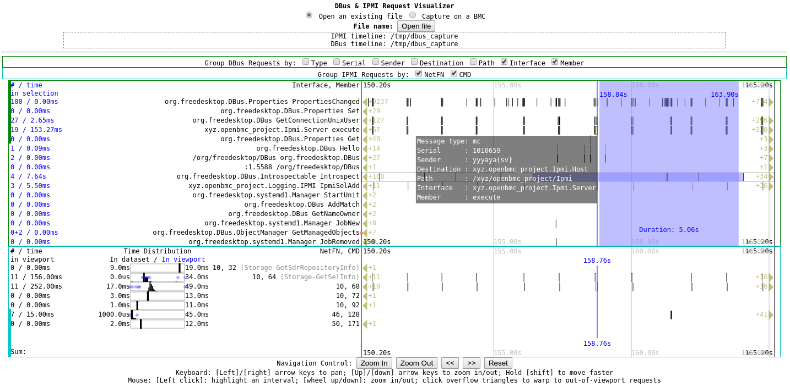

This program captures & visualizes IPMI traffic on a BMC running OpenBMC. It allows the user to capture & view IPMI requests in a time line format, as well as generate commands that can talk to `ipmid` or `ipmitool` to replay those IPMI requests.

## Build

This program is based on Electron, and should be compatible with Windows, Linux, Mac and ChromeOS's Linux environment.

The following commands are all run from this folder (where `index.html` is located.)

To build and run, a user would first need to install node.js and npm (Node.js package manager), and then checkout `dbus-pcap` to this folder. To install node.js on a Ubuntu/Debian-based system:

First, install `npm` and `node.js` using a method that is suitable for your setup.

```
$ node --version
v10.20.1
$ npm --version
6.14.4
```

Then, with `npm`, `node.js` installed and `dbus-pcap` downloaded to this folder, run the following commands:

1. `npm install`

2. `npm start`

## Run

### Open existing file

1. Select "Open an existing file"
2. Click "Open file"
3. Choose a file (The file should be a text file, and its contents should be dbus-monitor outputs)

### Capture

1. Select "Capture on a BMC"
2. Fill the Megapede client name in the text box
3. Choose a capture mode (live or staged)
4. Click "start capture" and watch the status updates
5. Click "stop capture" when done
6. If something happens, manual clean-up might be needed, such as stopping dbus-monitor on the BMC


